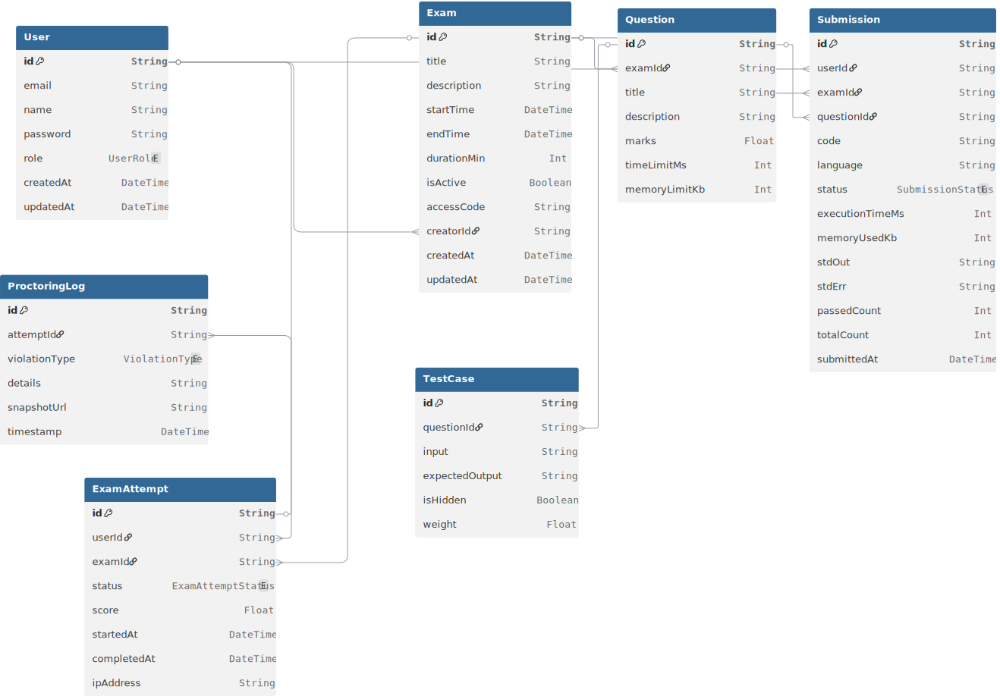

# Lab Exam Proctoring System with Online Compiler

## 1. Introduction
Lab examinations are essential for evaluating students' practical programming skills. However, traditional lab exams face issues such as missing compilers, system inconsistencies, and increased cheating due to easy access to online resources and LLMs.

This project proposes a centralized solution that integrates an online compiler with an exam-oriented proctoring system.

## 2. Objective
The objectives of this project are:

- Remove dependency on locally installed compilers during lab exams.
- Provide a uniform coding environment for all students.
- Minimize exam-time delays caused by system setup issues.
- Reduce cheating and misuse of LLMs during lab examinations.
- Simplify monitoring and management of lab exams for faculty.

## 3. Existing Problems
Current lab exam systems suffer from the following drawbacks:

- Compiler unavailability: Required compilers or correct versions may not be installed on all systems.
- Time loss: Installing or configuring software during exams wastes valuable time.
- Lack of uniformity: Different operating systems and environments lead to inconsistent program behavior.
- High cheating risk: Students can easily access the internet, LLMs, or external help.
- Manual proctoring limitations: Invigilators cannot continuously and effectively monitor all students.

## 4. Proposed Solution / Our Thought
We propose a web-based platform that combines:

- Online compiler: A centralized, browser-based compiler preconfigured with required programming languages, ensuring identical execution environments for all students.
- Proctoring system: Continuous monitoring during exams to detect suspicious activities such as tab switching, unauthorized access, or abnormal behavior patterns.

By integrating both components, the system creates a controlled and fair examination environment while eliminating local setup dependencies.

## 5. Key Features

- Web-based coding interface with real-time code execution.
- Controlled exam access with restricted actions.
- Continuous activity monitoring and logging.
- Reduced dependency on local machine configuration.

## 6. Tech Stack
The system is built using the following technologies to ensure scalability, performance, and security:

- Frontend: React (dynamic and responsive user interface).
- Backend: Express.js (Node.js framework for API requests and business logic).
- Database: PostgreSQL (robust structured storage for student records and exam logs).

## 7. Advantages

- Saves exam time by removing installation and configuration steps.
- Ensures fairness through a uniform coding environment.
- Reduces cheating and misuse of AI-based tools.
- Eases workload on faculty and invigilators.
- Scales for large numbers of students.

## 8. Limitations and Assumptions

- Requires stable internet connectivity.
- Students must use a compatible web browser.
- Effectiveness of proctoring depends on monitoring rules and system accuracy.

## 9. Future Scope

- Support for additional programming languages.
- More advanced AI-based proctoring techniques.
- Integration with institutional systems such as LMS.

## 10. Conclusion
The Lab Exam Proctoring System with an Online Compiler addresses key challenges in conducting lab exams. By ensuring a uniform coding environment and strengthening exam monitoring, the proposed system improves exam efficiency, fairness, and academic integrity.

## Database Schema

Click the diagram to view the interactive version.

## Full Project Flow

The end-to-end product flow Mermaid diagram lives in [docs/full-project-flow.md](./docs/full-project-flow.md).
It reflects the current codebase and explicitly labels the planned pieces that are not implemented yet.
